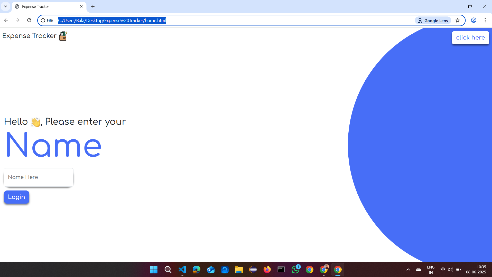
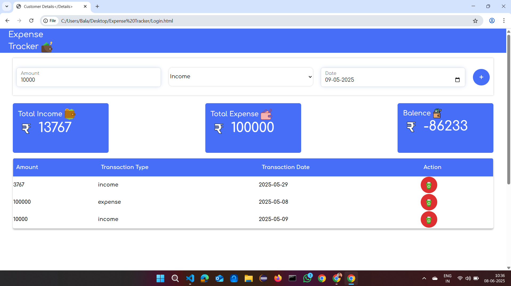

# 💸 Expense Tracker Web Application 

A responsive and interactive web application for tracking income and expenses in real time. This project helps users manage their personal finances with a clean interface and intuitive user experience.

## 🌟 Features

- 🔐 Login interface with name input
- ➕ Add income and expense transactions
- 📊 Automatically updates:
  - Total Income
  - Total Expense
  - Remaining Balance
- 🧾 View and delete individual transactions
- 📱 Fully responsive design using Bootstrap and custom CSS

## 📂 Project Structure

📁 Expense Tracker/

├── index.html # Landing page

├── Login.html # Main expense tracker interface

├── home.css # Styles for landing page

├── Login.css # Styles for main tracker

├── rupees1.png # Currency icon

├── recycle.png # Delete icon

├── tracker.png # Header icon

├── totalincome.png # Income icon

├── totalexpense.png # Expense icon

├── expense1.png # Balance icon

├── handwave.png # UI emoji icon

├── README.md # This file

└── LICENSE.md # Open-source license (MIT)

## 🖥️ Technologies Used

- **HTML5** – Page structure
- **CSS3** – Styling with responsiveness
- **Bootstrap 5** – UI components and grid
- **JavaScript** – DOM manipulation and logic

## 📷 Screenshots

> *(You can upload screenshots to GitHub and link them here)*

| Landing Page | Expense Dashboard |
|--------------|-------------------|
|  |  |

## 🚀 Getting Started

### 👉 Run Locally

1. Clone the project:
   git clone https://github.com/Dudekularajesh/Expense_Tracker_Web_Application.git
Open index.html in any modern browser.

🌐 View Live
Visit the live site (if hosted with GitHub Pages):
https://dudekularajesh.github.io/Expense_Tracker_Web_Application/

Make sure your homepage file is named index.html

📄 License
This project is licensed under the MIT License – free to use, modify, and distribute.

🙋‍♂️ Author

Dudekula Rajesh

🔗 https://www.linkedin.com/in/dudekula-rajesh-ab1a3b259?utm_source=share&utm_campaign=share_via&utm_content=profile&utm_medium=android_app 

📧 Email: dudekularajesh3337@gmail.com
